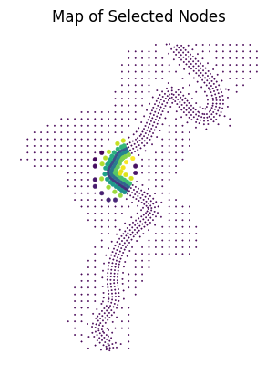

# constants

Contains constants used throughout the codebase.

### Overview

| Filename | Description |
|---|---|
| test_constants.py | Contains constants used for testing (ex. nodes to include for local mass loss). |

Notes
- The area below is selected for computation of local mass loss during testing.

