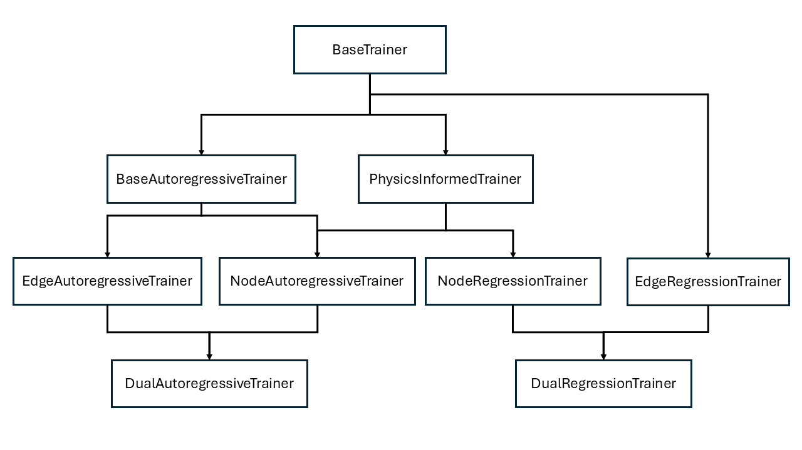

# training

Contains Trainer classes used to train the model.

### Overview

| Filename | Class Name | Description |
|---|---|---|
| \_\_init\_\_.py | N/A | Contains the trainer_factory function which loads the proper trainer class based on the given arguments. |
| base_trainer.py | BaseTrainer | Base class used by all trainer classes. |
| physics_informed_trainer.py | PhysicsInformedTrainer | Class that contains important functions for applying physics-informed loss in training. |
| node_regression_trainer.py | NodeRegressionTrainer | Trainer class for training with regression in a supervised manner. Used on models that perform only node prediction. |
| edge_regression_trainer.py | EdgeRegressionTrainer | Trainer class for training with regression in a supervised manner. Used on models that perform only edge prediction. |
| dual_regression_trainer.py | DualRegressionTrainer | Trainer class for training with regression in a supervised manner. Used on models that can perform both node and edge prediction. |
| base_autoregressive_trainer.py | BaseAutoregressiveTrainer | Base class for training in an autoregressive manner using multi-step loss and curriculum training. |
| node_autoregressive_trainer.py | NodeAutoregressiveTrainer | Trainer class for training with regression in an autoregressive manner. Used on models that perform only node prediction. |
| node_autoregressive_trainer_pushforward.py | NodeAutoregressiveTrainer | Train in an autoregressive manner using the pushforward technique. Currently not being used. |
| edge_autoregressive_trainer.py | EdgeAutoregressiveTrainer | Trainer class for training with regression in an autoregressive manner. Used on models that perform only edge prediction. |
| dual_autoregressive_trainer.py | DualAutoregressiveTrainer | Trainer class for training with regression in an autoregressive manner. Used on models that can perform both node and edge prediction. |

